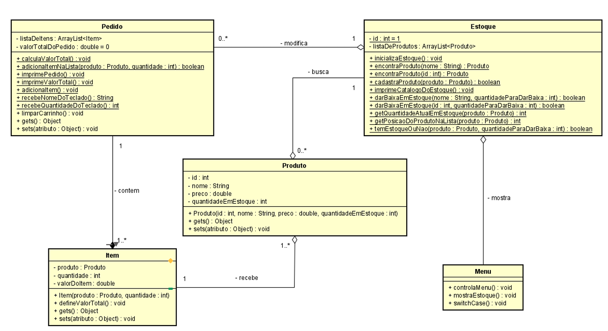

# Lista exercícios em Java

O propósito exercícios tem como finalidade aplicar os conceitos fundamentais da Programação Orientada a Objetos (POO) em
Java.

[](https://maven.apache.org/)
[](https://www.oracle.com/java/)

## 💻 Tecnologias e Ferramentas
- Linguagem: `Java 25` (JDK 25)
- Build: `Maven` (`pom.xml`)
- Testes: `JUnit 5`
- IDE recomendada: `IntelliJ IDEA` (2025.x ou superior)
- Controle de versão: `Git` / `GitHub`

---

### Princípios de POO

- **Abstração** \- modelar apenas os detalhes relevantes, expondo interfaces claras.
- **Encapsulamento** \- proteger o estado interno via modificadores de acesso e métodos.
- **Herança** \- reutilizar e especializar comportamentos entre classes relacionadas.
- **Polimorfismo** \- permitir diferentes implementações acessíveis por uma mesma interface.

As resoluções das questões serão resolvidas com base na lógica de programação e nas boas práticas de implementação em Java, visando o aprendizado e a consolidação dos princípios de POO.

---

### ✅ Questões Resolvidas


###  Questão 16 : Controle Empréstimo de Livros

Este é um projeto Java simples para gerenciar empréstimos de livros básicos.

### ✅ Regras de Negócio Testadas

Os testes automatizados garantem que as seguintes regras sejam respeitadas:

- **Pessoa**
    - Nome não pode ser vazio.
    - Idade deve ser maior que 0.
    - Método `validarLeitor()` retorna `true` apenas para leitores válidos.

- **Livro**
    - Título não pode ser vazio.
    - Autor e categoria devem ser informados.

- **Empréstimo**
    - Data de devolução não pode ser anterior à data de empréstimo.
    - Detalhes do empréstimo devem conter:
        - Nome do leitor
        - Título do livro
        - Autor do livro
        - Datas formatadas no padrão brasileiro (`dd/MM/yyyy`)
    - Permite devolução no mesmo dia ou após (dependendo da regra definida).
``
---
###  Questão 17 : Arvore Genealógica

Projeto em Java simples tem como finalidade a criação de arvore Genealógica.


### ✅ Regras de Negócio

#### Validação de Nomes
- **Obrigatoriedade:** 
   - Não pode ser `null` nem vazio (após `trim`).
- **Formato:** 
  - Deve conter apenas letras Unicode e espaços, regex `^[\\p{L}\\s]+$`.
- **Comprimento:** 
  - entre 2 e 100 caracteres.
- **Normalização:** 
  Múltiplos espaços internos são reduzidos para um único espaço.

#### Validação de Idade (Geral)
- **Não negativa:** 
  - Idade não pode ser menor que 0.
- **Limite superior:** 
  - Não pode ultrapassar `MAX_IDADE_GERAL` (ex.: 125 anos).

#### Idade Mínima dos Pais
 - Tanto mãe  quanto pai devem ter uma idade maior ou igual a `MIN_IDADE_PAIS` (ex.: 12 anos).

#### Relação Pais–Filho
 - Mãe e Pai devem ser, cada um, pelo menos `MIN_DIF_PAIS` anos mais velhos** que o Filho (ex.: 12 anos).

#### Relação Avós–Pais
 - Avós paternos devem ser pelo menos `IDADE_MIN_AVOS` anos mais velhos que o Pai.
 - Avós maternos devem ser pelo menos `IDADE_MIN_AVOS` anos mais velhos que a Mãe.
 - Idades de avós podem ser opcionais (`null`). Se fornecidas, são validadas.

#### Nomes Distintos

 - **Pai vs Mãe:** nomes não podem ser iguais (ignora maiúsculas/minúsculas).
 - **Pai vs Filho:** nomes não podem ser iguais.
 - **Mãe vs Filho:** nomes não podem ser iguais.
---
### ✅ Questão 18: Automóvel 

Resumo do módulo de Automóvel com validações e comportamentos específicos por tipo de veículo.


### ✅ Regras de Negócio principais
- Marca, modelo e cor não podem ser vazios.
- Placa deve seguir o formato padrão esperado pelo projeto (ex.: `OKU1234`).
- Campos modelo, marcar, cor e placa não podem ser nulos ou vazios.
- Placa deve seguir o formato padrão esperado pelo projeto (ex.: `OKU1234`).

### Comportamentos gerais
- Veículo pode ser ligado e desligado, com controle do estado (`ligado`/`desligado`).
- Métodos de informação retornam dados formatados do automóvel.

### Especializações e regras específicas
- Carro automático
  - Só pode ser ligado se o freio estiver pressionado.
  - Possui tipo de transmissão (ex.: `AUTOMATICA`).
- Moto com partida por pedal
  - Requer ação de partida (puxar acelerador/pedal) antes de ligar.
  - Possui tipo de transmissão (ex.: `MANUAL`).
- Guincho
  - Modela veículo de carga com comportamento próprio ao ligar e operações de carga/descarga.

### Testes
- Cobertura por testes unitários (JUnit 5) que validam:
  - Validações no construtor.
  - Operações de ligar/desligar.
  - Regras específicas de cada classe (CarroAutomatico, MotoPartidaPedal, Guincho).

---
### ✅ Questão 19: Agenda telefônica

Projeto em java que gerenciar uma agenda telefônica com funcionalidades de adicionar e remover contatos.

### ✅ Regras de Negócio Testadas

- **Contato**

    - Nome não pode ser vazio.
    - Número de telefone deve seguir o formato válido.
  
- **Agenda**
    - **Adicionar contato:** não permite duplicatas.
    - **Remover contato:** deve existir na agenda.
    - **Buscar contato:** retorna o contato correto ou indica se não encontrado.
    - **Listar contatos:** exibe todos os contatos ordenados por nome.

---

### Descrição do projeto
      
O projeto SuperMercadoProva simula o sistema de  gerenciamento de vendas de um supermercado, com controle de
estoque, verificação da existência produtos escolhidos no pedido e demais funcionalidades descritas no diagrama de classes do mesmo.

---
### Tarefas da Prova:

### a. Corrigir o bug *(Fácil)*
- Identificar e corrigir um erro existente no código para garantir o funcionamento correto do sistema.

### b. Desenvolver um método para cálculo do troco *(Médio)*
- Criar um método que:
    - Receba um valor pago pelo cliente.
    - Retorne o valor do troco com base no total da compra.

### c. Desenvolver um método para calcular a menor quantidade de notas *(Difícil)*
- Criar um método que:
    - Receba o valor do troco.
    - Calcule a menor quantidade possível de notas para entregar ao cliente.

---

### Diagrama de Classes
Abaixo está o diagrama de classes que representa a estrutura do sistema:




###  Funcionalidades
- Cadastrar produtos (nome, preço, quantidade)
- Listar estoque
- Repor estoque
- Dar baixa em estoque
- Adicionar itens ao pedido
- Alterar ou remover itens do pedido
- Finalizar pedido com cálculo de troco e emissão de recibo

---

### 🔒 Regras de Negócio
- Nome do produto:
    - Não pode ser nulo ou vazio
    - Não pode ser duplicado
    - Deve conter apenas letras e espaços
    - Tamanho entre 2 e 100 caracteres
- Preço:
    - Deve ser maior ou igual a zero
- Quantidade:
    - Deve ser maior que zero
- Estoque mínimo:
    - Não permitir baixa que deixe estoque abaixo do mínimo (padrão: 10)

---

### 🛠 Estrutura do Projeto
```
src/
 ├── org/academiadb/prova/
 │    ├── Menu.java          # Interface principal via terminal
 │    ├── Estoque.java       # Gerenciamento de produtos e estoque
 │    ├── Produto.java       # Modelo de produto
 │    ├── Pedido.java        # Gestão de itens do pedido
 │    └── validacaoSuperMercado/
 │         └── ValidadorProduto.java  # Validações de regras de negócio
```

---


### ▶️ Como Executar o programa

```bash
   java -cp out org.academiadb.prova.Menu
  ```

---

## 🧾 Exemplo de Execução
```
========= SuperMercado =========
1) Listar estoque
2) Cadastrar produto
3) Buscar produto (ID/Nome)
4) Repor estoque
5) Dar baixa em estoque (ID/Nome)
6) Adicionar item ao pedido
7) Alterar quantidade de item do pedido
8) Remover item do pedido
9) Ver pedido
10) Finalizar pedido (troco, emissão de recibo e baixa)
0) Sair
Escolha a opção: 2
Nome do produto: Arroz
Preço (R$): 3,89
Quantidade inicial em estoque: 12
Produto cadastrado com sucesso. ID: 1
```

---

### ✅ Validações Implementadas
- Nome normalizado (trim, espaços únicos, lowercase para índice)
- Preço não negativo
- Quantidade positiva
- Bloqueio de duplicidade antes do cadastro
- Estoque mínimo respeitado nas baixas

---

### Fluxo de Finalização do Pedido
1. Verifica disponibilidade de estoque para cada item
2. Recebe pagamento e calcula troco
3. Emite recibo com itens, total, pago e troco
4. Aplica baixas no estoque (captura exceções e gera avisos)
5. Exibe avisos após o recibo
6. Continua execução sem interromper o programa

---

### Boas Práticas
- Uso consistente de prompts para interação
- Normalização de nomes para evitar duplicidade
- Validações centralizadas em `ValidadorProduto`
- Tratamento de exceções sem encerrar o programa

---


